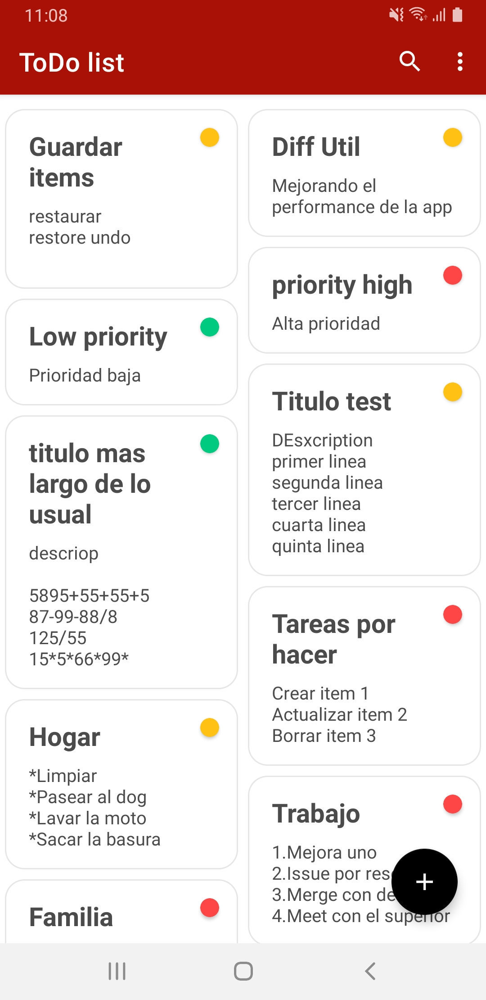

# App ToDo (Kotlin)

1. Develop ToDo App with Kotlin
2. Navigation Component
3. Safe args
4. Transition Animation
5. ROOM Database
6. CRUD operations
7. Data binding
8. Binding adapters
9. RecyclerView
10. Search database in RecyclerView
11. Sort database in RecyclerView
12. RecyclerView Animation
13. LiveData
14. ViewModel
15. Repository
16. Swipe to delete
17. Undo - restore deleted data
18. DiffUtil
19. Linear, Grid, Staggered Layout in RecyclerView
20. Clean Architecture

### Diseño de la app

 
